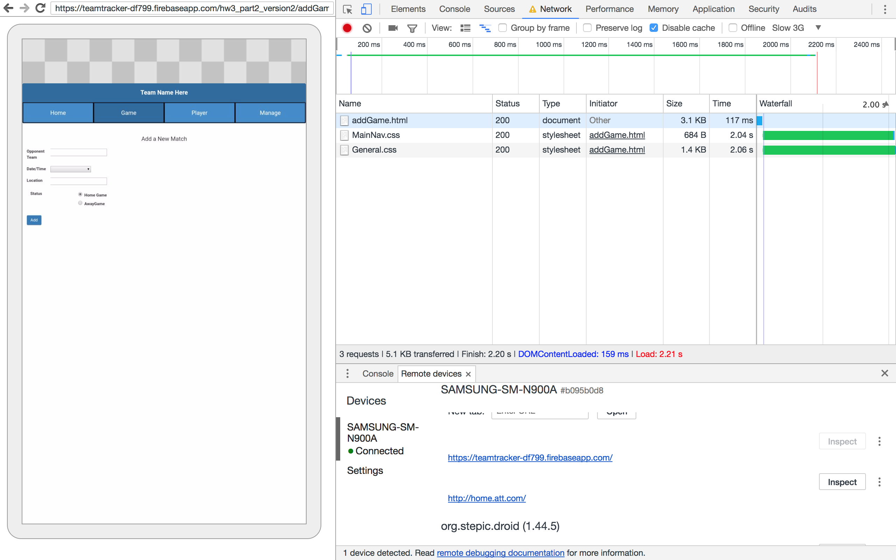
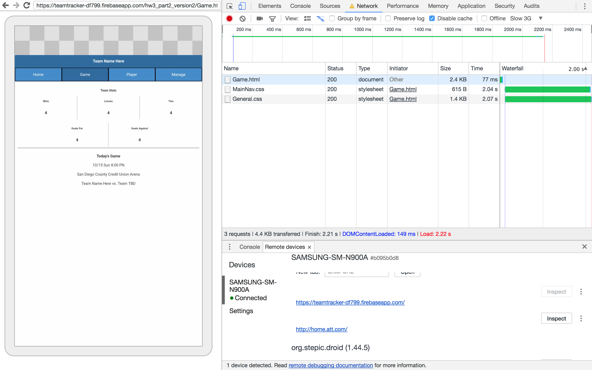
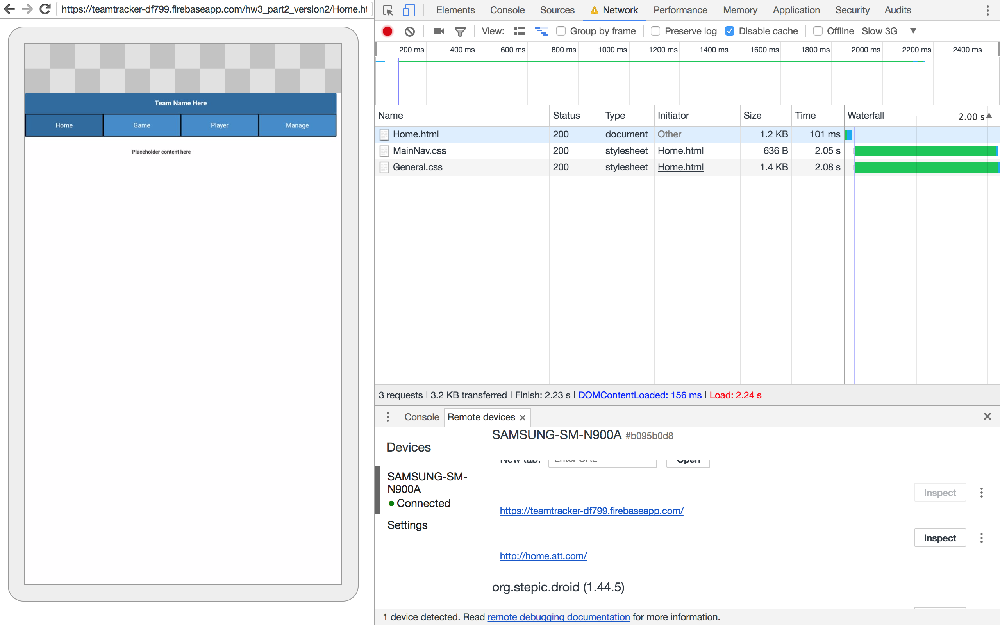
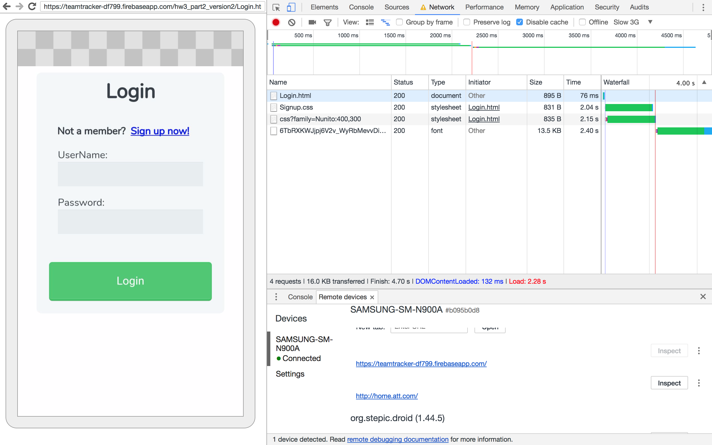
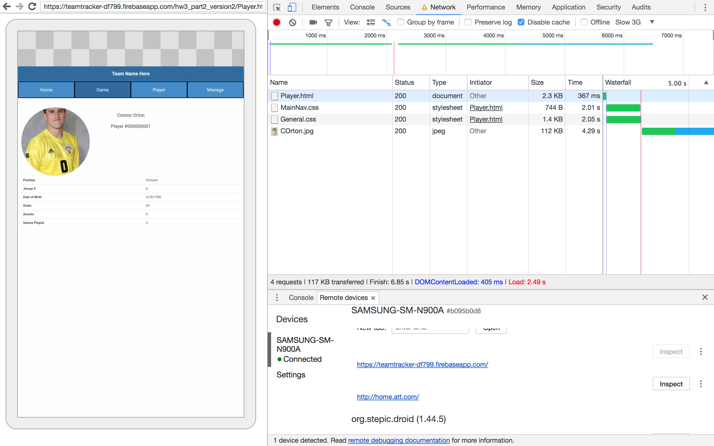
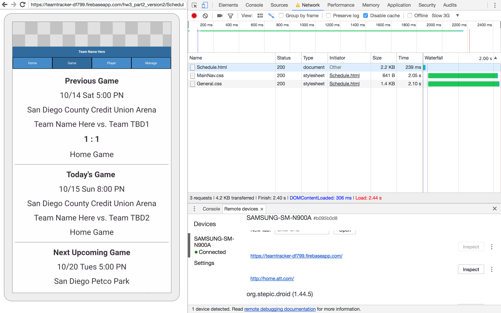
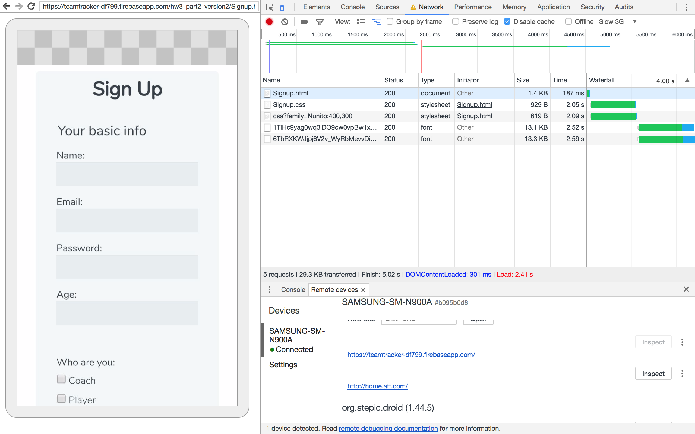

# [SITE LINK](https://teamtracker-df799.firebaseapp.com)

## [HW3 TODO:](http://classes.pint.com/cse134b/homework/hw2.html)
- Part2 (all of it)

HW3 site testing done on Samsung N900A on slow 3g connection.

results: 
Bootstrap 
AddGame.html			    6.39s 
GameBootstrap.html	  6.43s 
HomeBootstrap.html	  6.27s 
LoginBootstrap.html	  6.11s 
Player.html			      8.46s 
Schedule.html			    6.26s 
SignupBootstrap.html	4.20s 
Stats.html			      6.38s 

Vanilla 				
addGame.html			2.21s 
Game.html			    2.22s 
Home.html			    2.24s 
Login.html			  2.28s 
Player.html			  2.49s 
Schedule.html			2.44s 
Signup.html			  2.41s 
Stats.html			  2.61s 

As you can see there is a 2 - 4 times improvement in load times when using Vanilla vs Bootstrap. This is a result of simply using the rules we needed rather than loading the large Bootstrap stylesheet.

Screenshots:
--------------------------------------------------------------------------------
addgame:  

--------------------------------------------------------------------------------
game info:  

--------------------------------------------------------------------------------
home:  

--------------------------------------------------------------------------------
login: 

--------------------------------------------------------------------------------
player: 

--------------------------------------------------------------------------------
schedule: 

--------------------------------------------------------------------------------
signup: 

--------------------------------------------------------------------------------
stats: 

--------------------------------------------------------------------------------
